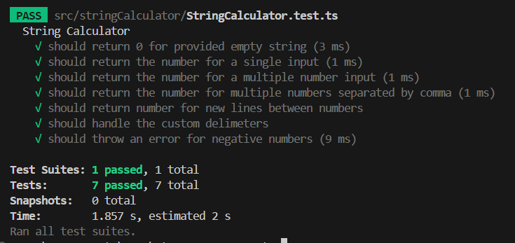

# String Calculator TDD

This is a JavaScript project implementing a **String Calculator** following the **Test-Driven Development (TDD)** approach. The project includes automated testing using Jest.
 
---
## Features

- Handles an empty string and returns `0`.
- Adds two or more comma-separated numbers.
- Supports newline (`\n`) as a delimiter.
- Supports custom delimiters (e.g., `//;\n1;2`).
- Throws an exception for negative numbers, listing all of them in the error message.

---
## Examples

| Input          | Output |
|-----------------|--------|
| `""`           | `0`    |
| `"1"`          | `1`    |
| `"1,5"`        | `6`    |
| `"1\n2,3"`     | `6`    |
| `"//;\n1;2"`   | `3`    |
| `"-1,-5"`      | Exception: "Negative numbers not allowed: -1, -5" |

---
## Coverage Summary

The following is a screenshot of the test coverage report:


---
## Project Setup

   ### Prerequisites
   - [Node.js](https://nodejs.org/) installed on your machine.

   ### Installation

   1. Clone the repository:
      ```bash
      git clone https://github.com/your-username/string-calculator.git
      cd string-calculator

   2. Install Dependencies
      ```bash
         npm install

   3. Run tests
      ```bash
         npm test

   ### Running Locally

      1. Start
         Update the input in the src/index.ts file with desired value then - 
         ```bash
            npm run start
      2. Test 
         ```bash
            npm run test


   ### Development Workflow

   This project follows TDD principles. To add new features:

   1. Write a test for the feature.
   2. Implement the feature.
   3. Refactor code as needed.


### License
   This project is licensed under the ISC License

---
### Acknowledgments
   This project is based on the String Calculator TDD Kata, designed for learning and practicing Test-Driven Development principles.